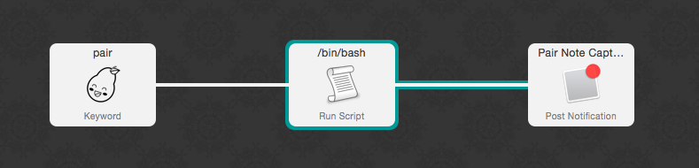

# Alfred Workflows


Note: workflows require the [powerpack](https://buy.alfredapp.com/).

## Pairing Notes

A bash script that appends data to a text file with a date prefix similar to:

```
Fri Jun  5 22:07:29 EDT 2015 | with Nick writing tests for tasks
```



Double click the Run Script action and replace the default file name ~/work/pairing_notes.txt in the Script with your preferred file path.
